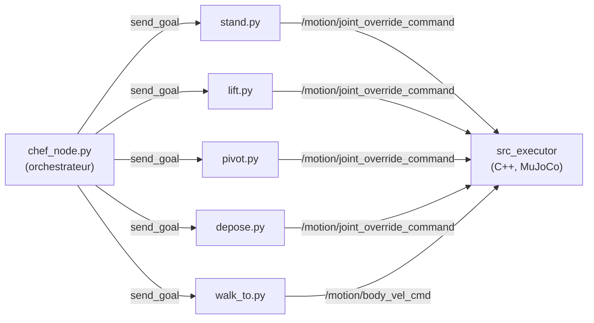
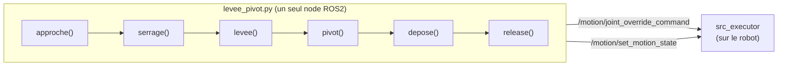

# ros2_engineai

Pipeline ROS2 pour piloter un robot humanoïde PM01 (EngineAI) : marche
jusqu'à un carton, prise à deux bras, pivot du buste, dépose à un second
poste -- **en simulation MuJoCo et sur le robot physique**.

## Objectif : pourquoi simu ET réel

Les deux versions partagent la même cinématique inverse des bras
(`tools/robot_arm_ik/lift_carton.py`), mais répondent à des besoins
différents :

- **La simulation** (`tools/virtual_gamepad/`) sert à itérer vite et sans
  risque : tester un réglage, un nouvel angle, une nouvelle trajectoire sans
  jamais exposer le robot physique à un mouvement mal calibré. C'est aussi
  là que la géométrie du carton/de la caméra est validée avant d'aller sur
  le vrai matériel.
- **Le robot réel** (`package_sequence_bras_reel/`) est la version
  simplifiée et durcie de la séquence, déployée une fois qu'un
  comportement est validé en simulation -- avec des marges de sécurité
  (vitesses réduites par défaut, confirmation manuelle entre chaque étape,
  vérification systématique de l'état de la machine à états avant tout
  mouvement).

Les deux ne sont **pas architecturées pareil** (voir Architecture
ci-dessous) : la simulation découpe la séquence en plusieurs nodes ROS2
indépendants (comme `chef_node.py` qui orchestre `lift`/`pivot`/`depose`),
alors que le robot réel tourne en un seul process qui enchaîne les étapes
directement en mémoire -- un choix délibéré pour éviter un bug de "relais"
entre nodes indépendants (deux calculs de cinématique inverse séparés
peuvent converger sur des postures de bras différentes pour une même
position de main).

## Démonstration

<table>
<tr>
<th>Simulation (MuJoCo)</th>
<th>Robot réel</th>
</tr>
<tr>
<td><video src="https://github.com/user-attachments/assets/b2cbb9ed-864f-400c-91af-6d2eb987d223" width="360" controls></video></td>
<td><video src="https://github.com/user-attachments/assets/f4f9cb6e-eddb-4ac3-b14e-eedf39d95371" width="360" controls></video></td>
</tr>
</table>

## Architecture

### Simulation -- plusieurs nodes ROS2 orchestrés



Chaque node est un **Action Server ROS2** indépendant, avec sa propre
instance `Lever` (classe qui publie les positions articulaires). `lift`,
`pivot` et `depose` recalculent chacun la posture du carton tenu à partir
de sa position réelle (vision/vérité terrain), pour rester synchronisés
malgré cette séparation en process distincts.

### Robot réel -- un seul process, une séquence linéaire



Une seule instance `Lever`, une seule fonction qui enchaîne les étapes --
la posture des bras (`qL`/`qR`) circule directement de fonction en
fonction en mémoire, sans jamais être recalculée depuis zéro.

### Pour aller plus loin

- [`docs/CODE_ROBOT_REEL.md`](docs/CODE_ROBOT_REEL.md) -- explication
  bloc par bloc de tout le code du robot réel (cinématique inverse,
  communication ROS2, machine à états, séquence complète).
- [`docs/CODE_SIMULATION.md`](docs/CODE_SIMULATION.md) -- explication
  bloc par bloc de tout le code de la simulation (`chef_node.py` et les
  5 Action Servers qu'il orchestre).

## Librairies et prérequis

- **ROS2 Humble** (`rclpy`, `rmw_cyclonedds_cpp`)
- **EngineAI Native SDK** (`src_executor`, machine à états, pont LCM) --
  fourni séparément, pas dans ce dépôt
- **MuJoCo** (simulation physique, via le SDK EngineAI)
- **NumPy** (cinématique inverse, `robot_arm_ik/lift_carton.py`)
- **LCM** (`python3-lcm`, communication bas niveau avec la simulation)
- **OpenCV** (`cv2`) + ArUco -- détection du carton par vision
- **Intel RealSense SDK** (`pyrealsense2`) -- caméra du robot réel
  uniquement (la simulation utilise une caméra fantôme, sans RealSense)

## Exécution

### Simulation

```bash
# Terminal 1 : la physique
cd <sdk>
./scripts/run_mujoco.sh pm01_edu_carton

# Terminal 2 : le "cerveau" (marche, machine à états)
cd <sdk>
source /opt/ros/humble/setup.bash
./run.sh pm01_edu_carton

# Terminal 3 : la séquence complète
cd tools/virtual_gamepad/ros_ws
export ROS_DOMAIN_ID=69
source /opt/ros/humble/setup.bash
source <sdk>/build/ros2_env/install/local_setup.bash
colcon build --packages-select virtual_gamepad_interfaces virtual_gamepad_ros
source install/setup.bash
ros2 launch virtual_gamepad_ros virtual_gamepad.launch.py
```

### Robot réel

```bash
cd package_sequence_bras_reel
python3 levee_pivot.py --angle-deg 90
```

Confirmation manuelle entre chaque étape par défaut (Entrée pour continuer,
Ctrl+C pour arrêter) -- ajouter `--no-confirm` pour enchaîner sans pause,
`--dry-run` pour vérifier la trajectoire sans rien publier au robot.

## Structure du dépôt

```
tools/virtual_gamepad/ros_ws/    package ROS2 de la simulation (nodes + interfaces .action)
package_sequence_bras_reel/      sequence bras robot reel, simplifiee, un seul process
tools/robot_arm_ik/              cinematique inverse des bras, partagee sim/reel
tools/vision/                    detection ArUco du carton, camera pelvis (sim + reel)
assets/                          scene MuJoCo, configs du robot simule
docs/                            guides de lancement (Docker, ROS2, camera)
```
