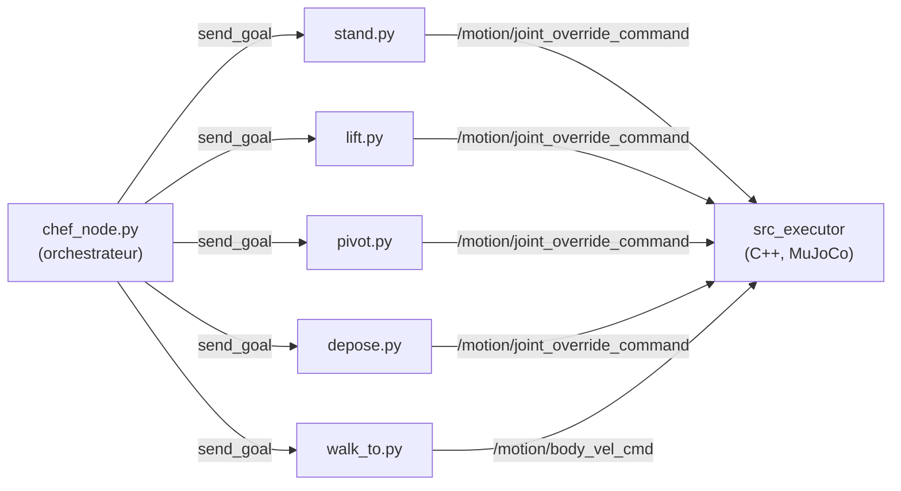
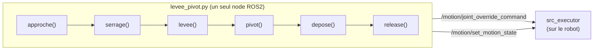

# ros2_engineai

Pipeline ROS2 pour piloter un robot humanoïde PM01 (EngineAI) : marche
jusqu'à un carton, prise à deux bras, pivot du buste, dépose à un second
poste -- **en simulation MuJoCo et sur le robot physique**.

## Objectif : pourquoi simu ET réel

Les deux versions partagent la même cinématique inverse des bras
(`tools/robot_arm_ik/lift_carton.py`), mais répondent à des besoins
différents :

- **La simulation** (`tools/virtual_gamepad/`) sert à itérer vite et sans
  risque : tester un réglage, un nouvel angle, une nouvelle trajectoire sans
  jamais exposer le robot physique à un mouvement mal calibré. C'est aussi
  là que la géométrie du carton/de la caméra est validée avant d'aller sur
  le vrai matériel.
- **Le robot réel** (`package_sequence_bras_reel/`) est la version
  simplifiée et durcie de la séquence, déployée une fois qu'un
  comportement est validé en simulation -- avec des marges de sécurité
  (vitesses réduites par défaut, confirmation manuelle entre chaque étape,
  vérification systématique de l'état de la machine à états avant tout
  mouvement).

Les deux ne sont **pas architecturées pareil** (voir Architecture
ci-dessous) : la simulation découpe la séquence en plusieurs nodes ROS2
indépendants (comme `chef_node.py` qui orchestre `lift`/`pivot`/`depose`),
alors que le robot réel tourne en un seul process qui enchaîne les étapes
directement en mémoire -- un choix délibéré pour éviter un bug de "relais"
entre nodes indépendants (deux calculs de cinématique inverse séparés
peuvent converger sur des postures de bras différentes pour une même
position de main).

## Démonstration

<table>
<tr>
<th>Simulation (MuJoCo)</th>
<th>Robot réel</th>
</tr>
<tr>
<td><video src="https://github.com/user-attachments/assets/b2cbb9ed-864f-400c-91af-6d2eb987d223" width="360" controls></video></td>
<td><video src="https://github.com/user-attachments/assets/f4f9cb6e-eddb-4ac3-b14e-eedf39d95371" width="360" controls></video></td>
</tr>
</table>

## Architecture

### Simulation -- plusieurs nodes ROS2 orchestrés



Chaque node est un **Action Server ROS2** indépendant, avec sa propre
instance `Lever` (classe qui publie les positions articulaires). `lift`,
`pivot` et `depose` recalculent chacun la posture du carton tenu à partir
de sa position réelle (vision/vérité terrain), pour rester synchronisés
malgré cette séparation en process distincts.

### Robot réel -- un seul process, une séquence linéaire



Une seule instance `Lever`, une seule fonction qui enchaîne les étapes --
la posture des bras (`qL`/`qR`) circule directement de fonction en
fonction en mémoire, sans jamais être recalculée depuis zéro.

### Pour aller plus loin

- [`docs/CODE_ROBOT_REEL.md`](docs/CODE_ROBOT_REEL.md) -- explication
  bloc par bloc de tout le code du robot réel (cinématique inverse,
  communication ROS2, machine à états, séquence complète).
- [`docs/CODE_SIMULATION.md`](docs/CODE_SIMULATION.md) -- explication
  bloc par bloc de tout le code de la simulation (`chef_node.py` et les
  5 Action Servers qu'il orchestre).

## Librairies et prérequis

- **ROS2 Humble** (`rclpy`, `rmw_cyclonedds_cpp`)
- **EngineAI Native SDK** (`src_executor`, machine à états, pont LCM) --
  fourni séparément, pas dans ce dépôt
- **MuJoCo** (simulation physique, via le SDK EngineAI)
- **NumPy** (cinématique inverse, `robot_arm_ik/lift_carton.py`)
- **LCM** (`python3-lcm`, communication bas niveau avec la simulation)
- **OpenCV** (`cv2`) + ArUco -- détection du carton par vision
- **Intel RealSense SDK** (`pyrealsense2`) -- caméra du robot réel
  uniquement (la simulation utilise une caméra fantôme, sans RealSense)

## Exécution

### Simulation

```bash
# Terminal 1 : la physique
cd <sdk>
./scripts/run_mujoco.sh pm01_edu_carton

# Terminal 2 : le "cerveau" (marche, machine à états)
cd <sdk>
source /opt/ros/humble/setup.bash
./run.sh pm01_edu_carton

# Terminal 3 : la séquence complète
cd tools/virtual_gamepad/ros_ws
export ROS_DOMAIN_ID=69
source /opt/ros/humble/setup.bash
source <sdk>/build/ros2_env/install/local_setup.bash
colcon build --packages-select virtual_gamepad_interfaces virtual_gamepad_ros
source install/setup.bash
ros2 launch virtual_gamepad_ros virtual_gamepad.launch.py
```

### Robot réel

```bash
cd package_sequence_bras_reel
python3 levee_pivot.py --angle-deg 90
```

Par défaut, chaque étape s'arrête et attend une touche Entrée avant de
continuer (sécurité pour vérifier visuellement le robot) -- utile la
première fois, à désactiver une fois la séquence validée :

```bash
python3 levee_pivot.py --angle-deg 90 --no-confirm --skip-motion-state
```

`--skip-motion-state` saute la vérification/bascule automatique en
`lower_body_balance` -- à utiliser seulement si le robot y est déjà
(sinon publier des positions n'a aucun effet visible, voir la section
`motion_state.py` de [`docs/CODE_ROBOT_REEL.md`](docs/CODE_ROBOT_REEL.md)).

#### Toutes les options

| Option | Défaut | Effet |
|---|---|---|
| `--angle-deg` | `20.0` | Angle de rotation du buste (degrés) |
| `--pinch-x` | `0.216` | Distance de visée du carton (mètres, axe X) |
| `--pinch-z` | `0.05` | Hauteur de visée du carton (mètres, repère bassin) |
| `--pinch-yaw-offset` | `0.0` | Correction de cap si le robot ne s'arrête pas pile en face du carton (radians) |
| `--wrist-rotation-deg` | `0.0` | Rotation du poignet verrouillée pendant toute la prise (degrés) |
| `--walk-stance-scale` | `0.0` | Flexion des genoux avant la prise (`0` = jambes droites, `1` = flexion complète) |
| `--pivot-duration` | `2.5` | Durée de la rotation du buste (secondes) -- aussi utilisée pour le dépivot |
| `--hold-seconds` | `0.9` | Temps de maintien une fois le buste pivoté |
| `--retract-x` | `0.19` | Position X du carton "rapproché du corps" pendant le pivot |
| `--depose-x` | `0.40` | Position X du carton "tendu" pour la dépose |
| `--retract-duration` | `0.6` | Durée du rapproché, fusionnée avec le DÉBUT du pivot |
| `--extend-duration` | `0.6` | Durée de l'extension, fusionnée avec la FIN du pivot (`retract_duration + extend_duration` doit rester `<= pivot_duration`) |
| `--release-ramp-seconds` | `0.9` | Durée de la rampe de relâchement final (poids 1.0 → 0.0) |
| `--pre-release-drop` | `0.03` | Petite baisse du carton avant relâchement (mètres) |
| `--pre-release-drop-duration` | `0.9` | Durée de cette baisse |
| `--open-duration` | `1.3` | Durée de l'ouverture de la prise (désserrage) |
| `--ecartement-gap-y` | `0.025` | Écartement supplémentaire des mains avant de les retirer (mètres) |
| `--ecartement-duration` | `1.3` | Durée de cet écartement |
| `--retreat-back-x` | `0.19` | Position X où ramener la main avant de la replier |
| `--retreat-back-duration` | `1.3` | Durée de cette translation arrière |
| `--degagement-waypoint-duration` | `1.3` | Durée du retour au point de passage "coudes vers l'arrière" |
| `--retreat-duration` | `1.0` | Durée du retour des bras le long du corps (après le dépivot) |
| `--only-phase` | *(aucune)* | Rejoue UNE SEULE étape : `approche`, `serrage`, `levee` ou `pivot` (voir ci-dessous) |
| `--skip-motion-state` | *(désactivé)* | Ne vérifie/force pas l'état `lower_body_balance` avant de commencer |
| `--dry-run` | *(désactivé)* | Calcule et affiche la trajectoire sans rien publier au robot ni se connecter à ROS2 |
| `--no-confirm` | *(désactivé)* | N'attend pas de touche Entrée entre les étapes |

#### Rejouer une seule étape avec `--only-phase`

Utile pour calibrer/déboguer une étape sans refaire toute la séquence à
chaque fois -- chaque appel garde les bras tenus là où l'appel précédent
les a laissés (nécessite le même process/`Lever`, donc ne PAS relancer le
script entre deux appels `--only-phase` si l'objectif est d'enchaîner) :

```bash
# 1) approche seule -- vérifie la visée avant de toucher le carton
python3 levee_pivot.py --only-phase approche --no-confirm

# 2) serrage seul -- une fois l'approche validée
python3 levee_pivot.py --only-phase serrage --no-confirm

# 3) levée seule
python3 levee_pivot.py --only-phase levee --no-confirm

# 4) pivot + depose -- termine la sequence
python3 levee_pivot.py --only-phase pivot --angle-deg 90 --no-confirm
```

#### Vérifier une trajectoire sans toucher au robot

```bash
python3 levee_pivot.py --angle-deg 90 --dry-run
```

`--dry-run` calcule toute la séquence (IK compris) et affiche les valeurs
clés à chaque étape, sans jamais se connecter à ROS2 ni publier quoi que
ce soit -- le moyen le plus sûr de tester un nouveau réglage avant de le
lancer pour de vrai.

## Structure du dépôt

```
tools/virtual_gamepad/ros_ws/    package ROS2 de la simulation (nodes + interfaces .action)
package_sequence_bras_reel/      sequence bras robot reel, simplifiee, un seul process
tools/robot_arm_ik/              cinematique inverse des bras, partagee sim/reel
tools/vision/                    detection ArUco du carton, camera pelvis (sim + reel)
assets/                          scene MuJoCo, configs du robot simule
docs/                            guides de lancement (Docker, ROS2, camera)
```
